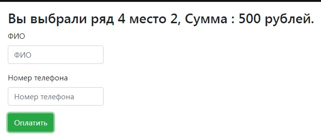

# job4j_cinema
В данном проекте реализован сервис бронирования билетов в кинотеатр:

Можно выбрать свободное место и ряд, затем перейти к бронированию.

В случае успешного бронирования, другому покупателю занятое место уже нельзя выбрать.

Так же, если двумя покупателями одновременно выбрано одно место, то оно будет забронировано за тем,
кто первым нажал на кнопку "Оплатить", а "опоздавшему" будет предложено выбрать другое место.

В данном проекте применены технологии: Bootstrap, Servlet,
шаблон MVC, PostgreSQL, JavaScript, AJAX, JSON

Проект разворачивается на сервере Apache Tomcat.
Все данные сохраняются в PostgreSQL

Скриншоты:
1. Форма выбора места, где отмечены цветом занятые и свободные места
   
2. Форма ввода контактных данных
   
3. Валидация ввода контактных данных
   
4. Бронирование успешно завершено
   
5. Забронированное место сменило цвет на красный и стало недоступным для выбора
   
6. Кто-то успел забронировать место до нас
   